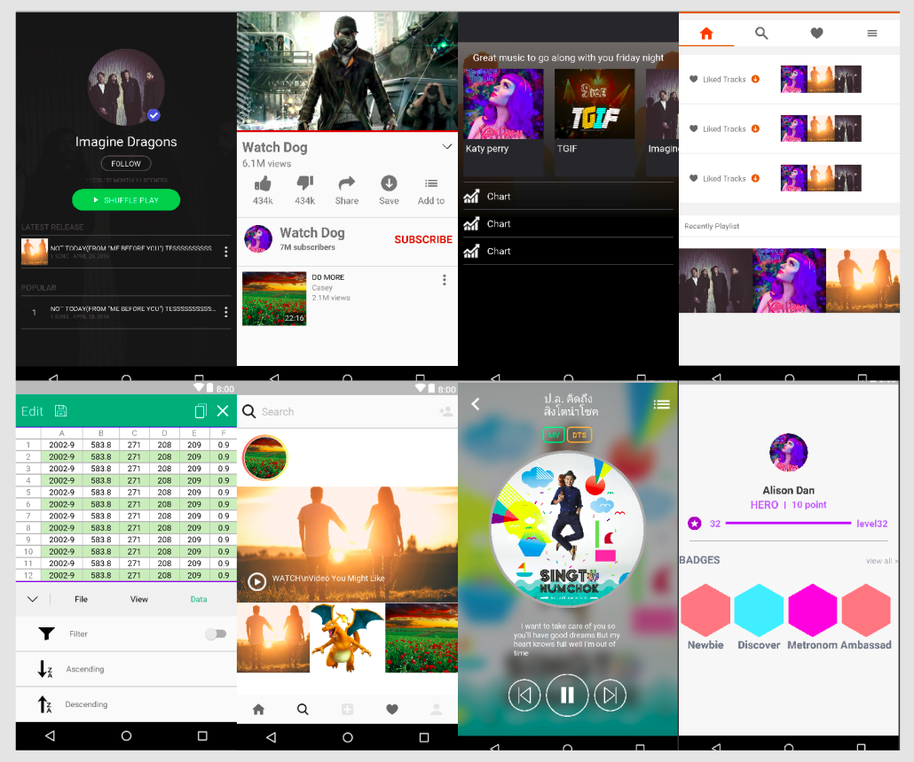
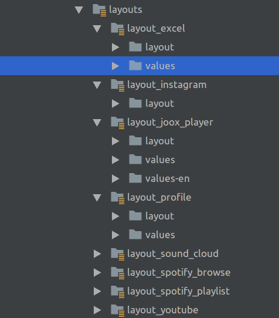
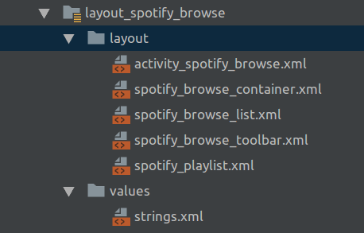

This project I want to share how to create Android layout in components style.



Clone this project [Github](https://github.com/champunderscore/Android.Layouts)

## Getting Started

Separate resource file for each layout.



#### build.gradle

```js
    sourceSets {
        main {
            res.srcDirs = [
                    'src/main/res/layouts/layout_excel',
                    'src/main/res/layouts/layout_youtube',
                    'src/main/res/layouts/layout_joox_player',
                    'src/main/res/layouts/layout_sound_cloud',
                    'src/main/res/layouts/layout_profile',
                    'src/main/res/layouts/layout_instagram',
                    'src/main/res/layouts/layout_spotify_browse',
                    'src/main/res/layouts/layout_spotify_playlist',
                    'src/main/res/layouts',
                    'src/main/res'
            ]
        }
    }

```

#### Layout Type

| Options           | Descriptions             |
| ----------------- | ------------------------ |
| Component         | Use for store Widgets    |
| Container         | Use for store components |
| Activity/Fragment | Use for store Containers |

Example



This example I create components `spotify_browser_list.xml`,`spotify_browser_toolbar.xml` and create `spotify_browser_container.xml` for store all component.

Then I create `activity_spotify_browser.xml` for store all containers.

#### spotify_browser_container.xml

```xml
<?xml version="1.0" encoding="utf-8"?>
<android.support.constraint.ConstraintLayout xmlns:android="http://schemas.android.com/apk/res/android"
    xmlns:app="http://schemas.android.com/apk/res-auto"
    xmlns:tools="http://schemas.android.com/tools"
    android:layout_width="match_parent"
    android:layout_height="match_parent">

    <include
        android:id="@+id/spotify_browse_toolbar"
        layout="@layout/spotify_browse_toolbar"
        android:layout_width="0dp"
        android:layout_height="wrap_content"
        app:layout_constraintEnd_toEndOf="parent"
        app:layout_constraintStart_toStartOf="parent"
        app:layout_constraintTop_toTopOf="parent" />

    <include
        android:id="@+id/spotify_playlist"
        layout="@layout/spotify_playlist"
        android:layout_width="wrap_content"
        android:layout_height="wrap_content"
        app:layout_constraintStart_toStartOf="@+id/spotify_browse_toolbar"
        app:layout_constraintTop_toBottomOf="@+id/spotify_browse_toolbar" />

</android.support.constraint.ConstraintLayout>

```

#### activity_spotify_browser.xml

```xml
<?xml version="1.0" encoding="utf-8"?>
<android.support.v4.widget.DrawerLayout
    xmlns:android="http://schemas.android.com/apk/res/android"
    xmlns:app="http://schemas.android.com/apk/res-auto"
    xmlns:tools="http://schemas.android.com/tools"
    android:id="@+id/drawer_layout"
    android:layout_width="match_parent"
    android:layout_height="match_parent"
    android:fitsSystemWindows="true"
    tools:openDrawer="start">

    <include
        layout="@layout/spotify_browse_container"
        android:layout_width="match_parent"
        android:layout_height="match_parent" />

    <android.support.design.widget.NavigationView
        android:id="@+id/nav_view"
        android:layout_width="wrap_content"
        android:layout_height="match_parent"
        android:layout_gravity="start"
        android:fitsSystemWindows="true"
        app:headerLayout="@layout/nav_header_main"
        app:menu="@menu/activity_sptify_playlist_drawer" />

</android.support.v4.widget.DrawerLayout>

```

### Values

I defined values in two types.

- One, Global value uses many where in a project.
- Two, Local value use in one layout.

#### Switch Activity

You can clone this project and switch activity in android manifest

```xml
 <activity android:name=".SpotifyPlaylistActivity">
    <intent-filter>
        <action android:name="android.intent.action.MAIN" />
        <category android:name="android.intent.category.LAUNCHER" />
    </intent-filter>
</activity>
```
