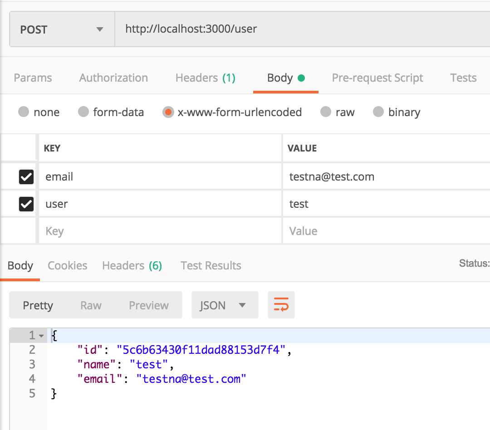

ในโปรเจคนี้เป็นการลองเขียน nodejs + rxjs ซึ่งเป็นโปรเจคที่ผมลองสร้างขึ้นเพื่อทดสอบเฉยๆนะครับ โดยสิ่งที่ได้ทำการทดลองก็คือ 
- ลองใช้ Class ใน js ดู
- ลองตั้งซื่อตัวแปรและ method ให้คล้ายๆ java
- ลองใช้ rxjs
- ลองเขียนแบบ functional

บทความหรือ docs ที่แนะนำ

- [Rxjs Documentation](https://rxjs-dev.firebaseapp.com/guide/overview)
- [Class](https://developer.mozilla.org/en-US/docs/Web/JavaScript/Reference/Classes)
- [10 Need-to-Know RxJS Functions with Examples](
https://www.sitepoint.com/rxjs-functions-with-examples/)

> ต้องบอกก่อนเลยว่าการเขียนแบบ oop ใน js ไม่ค่อย work เท่าไหร่ ส่วนตัวพอไปลองเขียน typescript กับรู้สึกชอบมากกว่า ถ้าเป็นสาย static type แนะนำ typescript เลยจ้า

clone this project [GitHub](https://github.com/champunderscore/node-rxjs-example)


## Getting Started

หลังจาก clone มาแล้ว ก็ต้อง start mongo ขึ้นมาซะก่อน สำหรับใครที่ไม่มี mongo ก็แนะนำให้ลง docker ซะ และก็ start mongo ด้วยคำสั่ง

```bash
docker run -d -p 27017:27017 --name mongo mongo
```

start project
```
npm install -g nodemon
npm i
npm start
```

มีอะไรให้เล่นบ้าง ก่อนอื่นมาลองดูโครงสร้างโปรเจคคร่าวๆกันก่อน

```
├── app
|  ├── config
|  ├── domain
|  ├── server
| ......
```
แน่นอนครับชั้นนอกสุดก็เป็นพวก project config ต่างๆ eslint, docker, package.json บลาๆ...

ส่วนใน app ก็เป็นทุกอย่างที่เกี่ยวกับ app ของเรา

- config เก็บ config หรือ env variable ต่างๆ
- domain อันนี้จะเก็บโค้ดต่างๆ
- server เก็บโค้ดเกี่ยวกับ server หรือ middleware บลาๆ

ลองดูใน `app/server/app.js` ก็จะเห็นส่วนที่เป็น middleware ของเราทั้งหมด 

endpoint ต่างๆจะถูกเก็บไว้ที่ `app/server/routes.js` เราลองมาดูว่ามีไรบ้าง

```js
/* test endpoint */
router.get('/test', (req, res) => {
  console.log(req)
  res.json({ test: 'test' })
})

/* get user by id */
router.get('/user', (req, res) => userController.mGetUser(req, res))
/* create user by email */
router.post('/user', (req, res) => userController.mCreate(req, res))
/* list users */
router.get('/users', (req, res) => userController.mListUser(req, res))
```

ผมจะลองยิงสร้าง user ด้วย postman ดู



ผลลัพธ์ที่ได้ก็ประมาณนี้ ถ้าเราลองไปเรียก get หรือ list ดูก็จะได้ค่าที่เราเพิ่งเพิ่มไป

## How it work

โค้ดทั้งหมดของเราจะถูกเก็บไว้ที่ domain แต่ว่าทำไมละ?

ลองนึกภาพว่าเราสร้าง api เกี่ยวกับ user ซักพักเราต้องสร้าง api เกี่ยวกับ admin และก็มี report ตามมา การแยก domain ทำให้เรารู้ว่าข้างในเก็บโค้ดของส่วนไหนอยู่ และยังง่ายต่อการกลับมาแก้ไขอีกด้วย แต่สิ่งหนึ่งที่แชร์กันได้ก็คือ repositories หรือ database นั่นละ เพราะบางที domain admin ก็มีโอกาศมาดึงข้อมูลของ user เหมือนกัน เพราะฉะนั้นเราจะเอา repositories ไว้ชั้นเดียวกับแต่ละ domain หน้าตาก็ประมาณนี้

```
├── domain
|  ├── repositories
|  ├── user
|  ├── admin
|  ├── report
```
อันนี้ในกรณีที่เราออกแบบให้เป็น Monolithic นะครับ แต่ถ้าเป็น Microservices ก็ยังมี Achitecture หลายๆแบบ ที่ตอบโจทย์
ส่วนในโปรเจคนี้ผมเขียนเองจากความเจ็บปวดล้วนๆ 555

ในแต่ละ domain ก็จะมีหน้าตาประมาณนี้

```
├── user
|  ├── controllers
|  ├── functionals
|  ├── models
|  ├── schemas
|  ├── business
```

> Controllers : ถ้าเราลองไปดูที่ routes.js ของเราก็จะเห็นว่ามันชี้มาที่ controller 
> โดยหน้าที่ของมันก็คือการรับ input ต่างๆที่ส่งมากับ request และทำการ validate 
> และส่งไปที่ชั้น business logic หลังจากนั้นก็ทำการ respone ข้อมูลกลับไป

> Business : อะไรก็ตามที่เป็น business logic เช่นดึงข้อมูลจาก repo และเอามาเพิ่ม point ให้ user แต่ละคน อื่นๆ... ก็จะถูกเก็บไว้ตรงนี้ 

> Functionals : อันนี้ตั้งซื่อชัดเจนมาก โค้ดส่วนไหนก็ตามที่แยกเป็น function ได้ ก็แยกเถอะนะ 
> อาจจะแยกไว้เป็นไฟล์หรือรวมเป็นไฟล์เดียวกันและตั้งซื่อให้ชัดเจนว่าใช้ใน controller หรือ business เท่านั้นก็ได้

> Models : เวลาที่จะปั้นข้อมูลไปเก็บใน db ก็ใช้ model ช่วยสิ

> Schemas : อันนี้เวลา controller จะ respone อะไร ก็มาปั้นหน้าตาในนี้ก่อนจะออกไป


Note : สามารถแยกไฟล์ controller หรือ business เป็นไฟล์ย่อยๆ ตาม api ก็ได้นะ เช่น list user ผมเห็นว่าโค้ดมันยาวก็แยกออกมาจากไฟล๋ UserController, UserBusiness ให้เป็นไฟล์สำหรับ api list user ไปเลย


## RxJs

ข่วงแนะนำบทความ สำหรับใครที่ไม่เคยใช้ rx มาก่อน แนะนำให้อ่านบทความด้านล่างซักนิดนึงนะครับ

- [The introduction to Reactive Programming you've been missing](https://gist.github.com/staltz/868e7e9bc2a7b8c1f754)
- [Observable](http://reactivex.io/documentation/observable.html)


`In ReactiveX an observer subscribes to an Observable. Then that observer reacts to whatever item or sequence of items the Observable emits. `

ถ้าลองเปิดใน `UserController.js` ก็จะเห็นว่าตัว controller ทำหน้าที่เป็น observer และ business และ repo ก็เป็น Observable
หลักการก็คือเวลา query หรือ insert ข้อมูล repo จะ return Observable ไปให้ business จากนั้น business จะเอาข้อมูลไปใช้งานต่อ เช่น

```js
mListUser() {
  const observable = this.userRepository.mListAllUser().pipe(
    map((data) => {
      return addUserPoint(data)
    })
  )

  return observable
}
```
>ในตัวอย่างนี้ผมเอา user แต่ละคนไป add point เพิ่ม

และจากนั้น controller ก็จะ subscribes เอาไว้และพอได้ข้อมูลก็จะ response ออกไป

ในด้านความสะดวกสบาย rxjs ก็มี function หลายๆอย่างให้เราใช้งาน 
ตัวอย่างเช่น เราต้องการดึงค่ามาจาก collection user และเอามารวมกับข้อมูลที่ดึงมาจาก collection อื่น 
ปกติก็ต้องไปใช้ lib อย่าง lodash หรือ underscore หรือไม่ก็เขียนเอง แต่ใน rxjs ก็มี `concat, merge` ให้เราสามารถใช้ได้เลย


## Test
ในส่วนของการ Test ในโปรเจคไม่ได้มีตัวอย่าง แต่เราสามารถ Test ได้ 
อย่างพวก Unit Test ก็เอา functional ที่เราแยกไว้แล้วมาเขียนได้เลย ส่วน Test แบบอื่นก็สามารถประยุกต์เอามาใช้ได้เหมือนกัน

## Conclusion

จบแล้วครับ หวังว่าจะเป็นประโยชน์ ถ้ามีอะไรผิดพลาดก็ขออภัยด้วยนะครับ